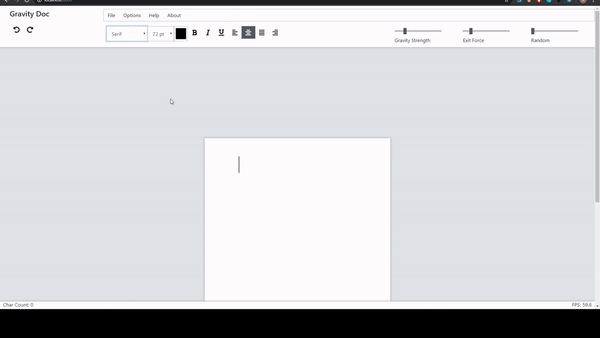

# GravityDoc
The physics simulation x text editor you've always wanted. Visit the site [here](https://gravity-doc.com/).

## Core Features:
* Changing force settings in real time
* Handling basic text editing instructions like copy (ctrl c), paste (ctrl v), save (ctrl s), etc
* Cheatcodes and their features, which shall be kept secret, unless you poke around in the source code

## Implementation

### Physics and Rendering
Physics simulation is powered by matter.js. Although matter.js ships with its own renderer, it is quite limited and offers very little customization. I opted to use p5.js for rendering, which came with the added benefits of simpler syntax and better performance.
### Hotkeys and Cheatcodes
Keypress handles all key combinations. Special thanks to David Mauro for putting out his awesome library!
### Styling and Layout
HTML/ CSS was my least favorite part of this project. Lets not talk about it.

## Deployment
Deployed via an AWS S3 bucket routed through Cloudfront for HTTPS.
